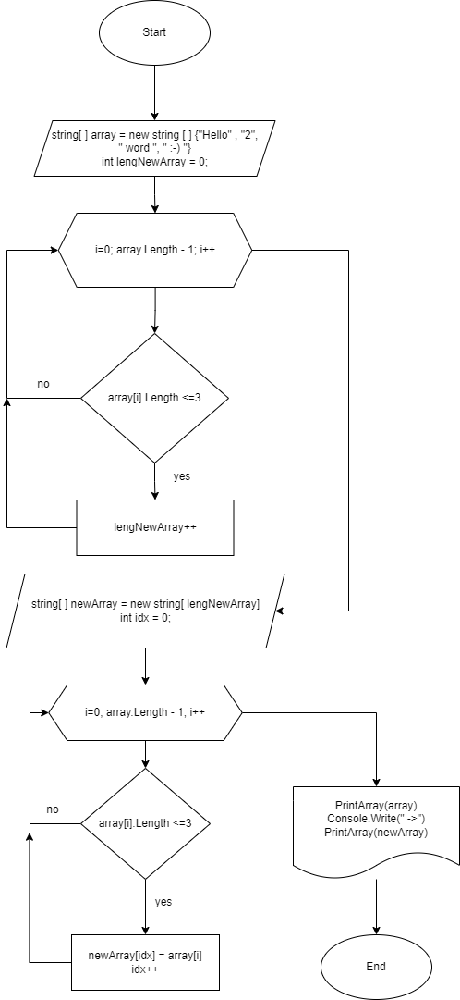

# Итоговая контрольная работа по основному блоку.

## **Условия задачи**:

1. Создать репозиторий на GitHub
2. Нарисовать блок-схему алгоритма (можно обойтись блок-схемой основной содержательной части, если вы выделяете её в отдельный метод)
3. Снабдить репозиторий оформленным текстовым описанием решения (файл README.md)
4. Написать программу, решающую поставленную задачу
5. Использовать контроль версий в работе над этим небольшим проектом (не должно быть так, что всё залито одним коммитом, как минимум этапы 2, 3, и 4 должны быть расположены в разных коммитах)

**Задача:** Написать программу, которая из имеющегося массива строк формирует новый массив из строк, длина которых меньше, либо равна 3 символам. Первоначальный массив можно ввести с клавиатуры, либо задать на старте выполнения алгоритма. При решении не рекомендуется пользоваться коллекциями, лучше обойтись исключительно массивами.

**Примеры:**
[“Hello”, “2”, “world”, “:-)”] → [“2”, “:-)”]
[“1234”, “1567”, “-2”, “computer science”] → [“-2”]
[“Russia”, “Denmark”, “Kazan”] → []

## **Решение**
1. Создан репозиторий "Final_test_work_1_block".
2. Ниже представлена блок-схема алгоритма решения поставленной задачи:
>
3. Был создан файл с текстовым описанием решения "README.md".
4. Программа расположена в репозитории по следующей ссылке: https://github.com/MacNill/C--/blob/master/Final_test/Program.cs 
Результат из терминала:
> 
5. Контроль версий проекта:
>
